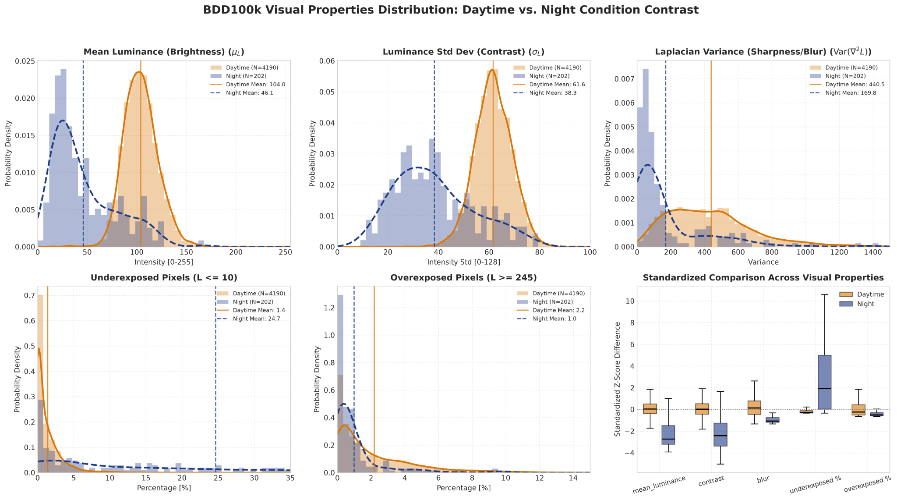
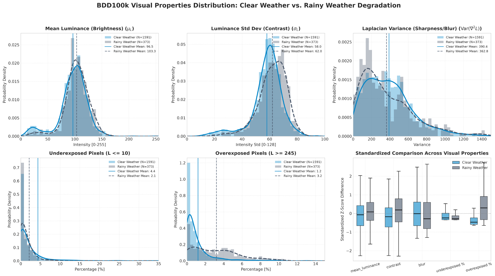
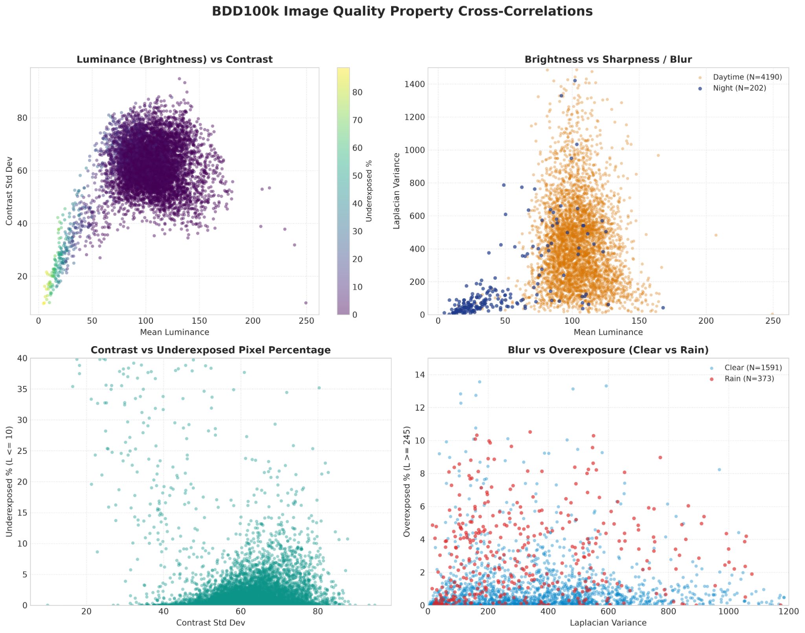
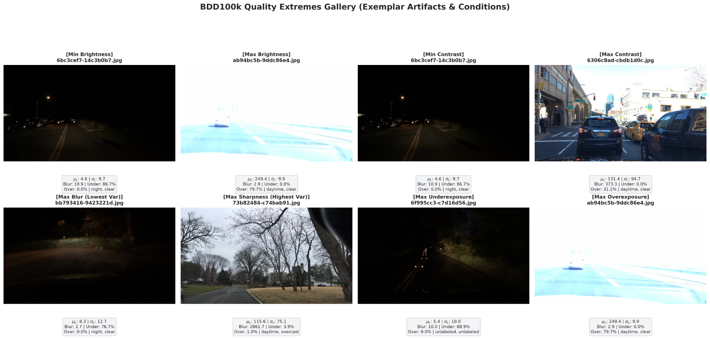
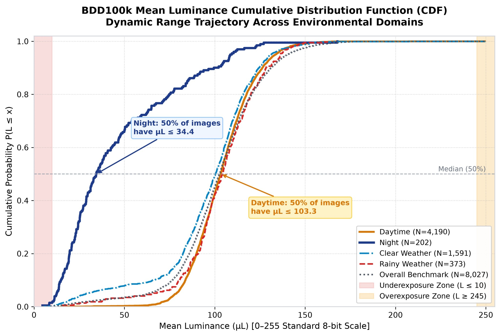

# Performance Analysis of Vision Transformers for Multi-Task Autonomous Vehicle Perception

[](https://www.python.org/)
[](LICENSE)
[](https://www.bdd100k.com/)

## 📌 Project Overview

Autonomous vehicle (AV) perception systems operate under diverse, challenging real-world environments including darkness, torrential rain, glare, and rapid motion blur. This Capstone Project investigates and benchmarks **Vision Transformers (ViTs)** against traditional convolutional architectures for multi-task perception tasks (such as object detection, drivable area segmentation, and lane detection).

This repository hosts the **data analysis, image-quality characterization engine, statistical evaluation, and presentation graphics pipeline** developed on the large-scale **BDD100K** dataset, alongside the project's technical phase reports.

---

## 👥 Authors & Project Team

- **Ojasvi Kumar Sahu** (23BHI10120)
- **Srishti Jindal** (23BHI10098)
- **Dhrubo Dutta** (23BHI10137)

---

## 📂 Repository Structure

```
capstone/
├── docs/                                          # Project proposals, phase reports, and review documents
│   ├── Capstion_Project_Phase_1_Review-1_Report.docx
│   └── autonomous_vehicle_vit_capstone_report.docx
├── src/                                           # Python source code for data extraction, stats, and plotting
│   ├── calculate_image_quality.py                 # Multi-threaded BDD100k image quality extractor
│   ├── analyze_and_plot.py                        # Statistical distributions & hypothesis tests
│   └── generate_presentation_illustrations.py    # Publication-ready dual-format figures & slide dashboards
├── results/
│   └── figures/                                   # High-resolution generated statistical plots & charts
│       ├── clear_vs_rain_distributions.png        # Clear vs. Rainy metric comparisons
│       ├── day_vs_night_distributions.png         # Daytime vs. Night driving distributions
│       ├── extreme_samples_gallery.png            # Visual gallery of extreme environmental degradation
│       ├── figure3_luminance_cdf_linechart.jpg    # Cumulative exposure and dynamic range CDF
│       └── visual_correlations.png                # Spearman rank correlation matrix
├── .gitignore                                     # Python, dataset, and OS exclusions
├── LICENSE                                        # Apache 2.0 License
├── requirements.txt                               # Project dependencies
└── README.md                                      # Project documentation
```

---

## 🔬 Methodology & Image Quality Metrics

The characterization pipeline evaluates each driving scene across several photometric and frequency-domain visual properties:

1. **Mean Luminance ($\mu_L$ - Brightness)**:
   $$\mu_L = \frac{1}{N} \sum_{i=1}^{N} L_i$$
   where $L_i$ represents the perceived luminance from the image's grayscale / Y-channel representation.

2. **Contrast Standard Deviation ($\sigma_L$)**:
   $$\sigma_L = \sqrt{\frac{1}{N} \sum_{i=1}^{N} (L_i - \mu_L)^2}$$
   Quantifies overall dynamic spread and tonal range of scene elements.

3. **Laplacian Variance ($\mathrm{Var}(\nabla^2 L)$ - Sharpness / Blur)**:
   Calculates the variance of the image convolved with the 2D discrete Laplacian operator. Low values indicate heavy motion blur, defocus, or occlusion (e.g. rain/fog).

4. **Exposure Deficiencies**:
   - **Underexposed Percentage**: Fraction of pixels with intensity $L \le 10$.
   - **Overexposed Percentage**: Fraction of pixels with intensity $L \ge 245$ (glare, direct headlight reflection).

5. **Statistical Testing**:
   - Non-parametric **Mann-Whitney $U$ test** and **Kolmogorov-Smirnov test** across weather and time-of-day strata.
   - **Cohen's $d$ effect sizes** to assess the magnitude of photometric divergence between operational design domains (ODDs).

---

## 📊 Visualizations & Key Findings

### 1. Day vs. Night Distributions
Distribution of luminance, contrast, blur, and exposure metrics comparing day-time driving to night-time driving conditions.


### 2. Clear vs. Rain Distributions
Impact of adverse weather (rain) on contrast degradation and Laplacian sharpness.


### 3. Metric Correlations
Spearman rank correlation matrix demonstrating interactions between luminance, contrast, blur, and exposure anomalies.


### 4. Extreme Samples Gallery
Exemplar scenes highlighting high underexposure, intense headlight glare, and weather-induced degradation.


### 5. Cumulative Exposure CDF
Line chart illustrating cumulative distribution functions (CDF) of luminance across varied environmental conditions.


---

## 🚀 Getting Started

### Prerequisites

- Python 3.9 or higher
- Git

### Installation

1. Clone the repository:
   ```bash
   git clone https://github.com/geekyfella/capstone.git
   cd capstone
   ```

2. Create and activate a virtual environment:
   ```bash
   python -m venv .venv
   # Windows:
   .venv\Scripts\activate
   # Linux/macOS:
   source .venv/bin/activate
   ```

3. Install required packages:
   ```bash
   pip install -r requirements.txt
   ```

---

## 🏃 Running the Analysis Pipeline

1. **Extract Image Quality Metrics**:
   ```bash
   python src/calculate_image_quality.py
   ```
   *Processes BDD100k raw image data in parallel and outputs `results/bdd100k_10k_image_quality.csv`.*

2. **Generate Statistical Distributions & Tests**:
   ```bash
   python src/analyze_and_plot.py
   ```
   *Calculates descriptive statistics, effect sizes, and outputs distribution plots to `results/figures/`.*

3. **Generate Presentation-Ready Figures**:
   ```bash
   python src/generate_presentation_illustrations.py
   ```
   *Generates high-resolution SVGs and 300 DPI figures for research slides and technical reports.*

---

## 📄 Documentation

Comprehensive technical documents and project reviews are located in the [`docs/`](docs/) directory:
- **Phase 1 Review Report**: [`docs/Capstion_Project_Phase_1_Review-1_Report.docx`](docs/Capstion_Project_Phase_1_Review-1_Report.docx)
- **Capstone Technical Report**: [`docs/autonomous_vehicle_vit_capstone_report.docx`](docs/autonomous_vehicle_vit_capstone_report.docx)

---

## 📜 License

This project is licensed under the Apache License 2.0. See the [LICENSE](LICENSE) file for details.
